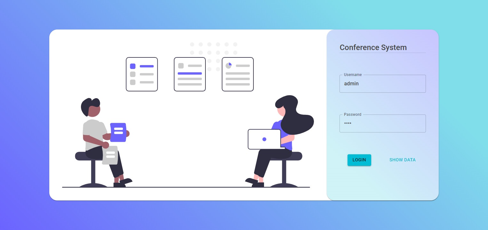
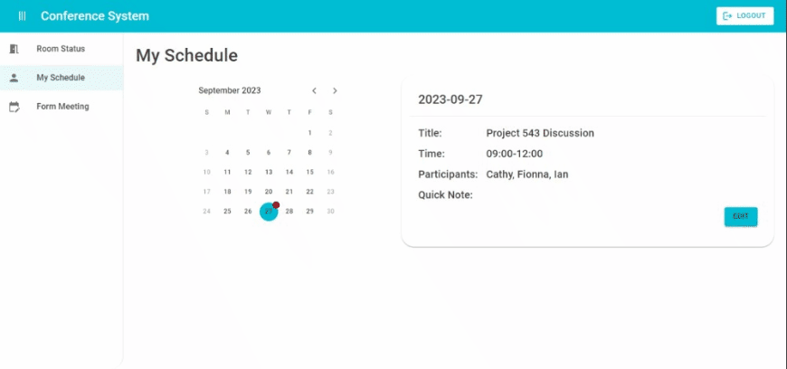

# Conference System
## Feature
- Login Page - Login validation
- Room Status - Using SVG to display floor map and each room status
- My Schedule - Shows calender and meeting info card that can take notes
- :construction: Form Meeting

Tools & Skills | Purpose
--- | ---
React Hooks |	useState for state management and useMemo for caching
MUI | UI components such as DateCalendar and DatePicker
Redux Toolkit | Cross component state managment
Formik | Manage form state and validation of login page
Notistack | Easy to use notification library
SVG | Displaying room map arrangment and change color according to room status
## Demo
[Demo Site](https://conference-system.vercel.app/)
### Login Page

### Room Status

### My Schedule

